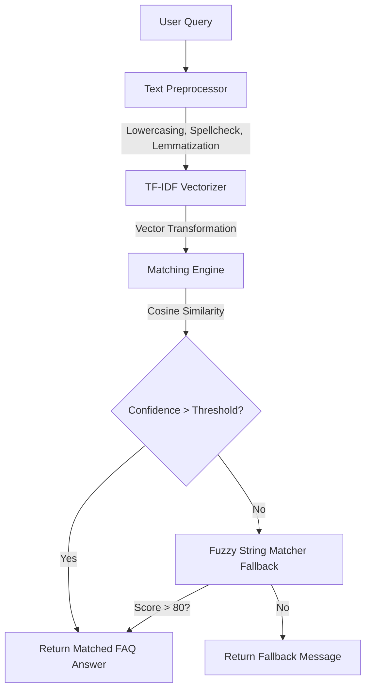

<h1 align="center">🤖 Enterprise FAQ Chatbot</h1>

<p align="center">
  
  
  
  
</p>

<p align="center">
  A production-ready, highly optimized FAQ Chatbot powered by TF-IDF, Cosine Similarity, and advanced Natural Language Processing (NLP). Built for hackathons, internships, and enterprise deployments.
</p>

---


*   **🧠 Advanced NLP Pipeline**: Incorporates tokenization, lemmatization, stop-word removal, and dynamic spell correction using `TextBlob`.
*   **⚡ Semantic Matching (TF-IDF + Cosine Similarity)**: Converts queries to vectors to understand the true intent behind the words, rather than just exact keyword matching.
*   **🛡️ Fuzzy Fallback Engine**: If semantic confidence drops below the dynamic threshold, a robust Levenshtein-distance fuzzy matcher kicks in to catch extreme typos.
*   **🎨 Premium Glassmorphism UI**: Built with Streamlit but heavily customized with raw CSS for a modern, dark-mode, animated interface.
*   **⚙️ Dynamic Control Panel**: Users can adjust the AI's confidence threshold in real-time via the sidebar.
*   **📊 Reinforcement Learning Ready (RLHF)**: Built-in 👍/👎 feedback mechanisms on bot responses.
*   **🐳 Dockerized Deployment**: Comes with a fully optimized, multi-stage `Dockerfile` ready for Render, AWS, or Streamlit Community Cloud.

## 📐 Architecture & Workflow

The system follows a strict modular design pattern for scalability.



### How Cosine Similarity Works Here
1. **Vectorization**: Every question in our FAQ database is converted into a mathematical vector (a point in multi-dimensional space) based on term frequency and importance (TF-IDF).
2. **User Input Transformation**: When a user asks a question, it is preprocessed and projected into that exact same multi-dimensional space.
3. **Similarity Calculation**: We measure the angle (Cosine) between the user's vector and all FAQ vectors. An angle of 0° means the vectors are identical (Cosine = 1). The closest vector is our matched answer!

---

## 🚀 Quick Start & Installation

### Option 1: Local Setup (Virtual Environment)
```bash
# 1. Clone the repository and navigate to the directory
cd faq_chatbot

# 2. Create and activate a virtual environment
python -m venv venv
source venv/bin/activate  # On Windows: venv\Scripts\activate

# 3. Install dependencies
pip install -r requirements.txt

# 4. Run the application
streamlit run app.py
```

### Option 2: Docker Setup (Production)
```bash
# 1. Build the Docker image
docker build -t faq-chatbot .

# 2. Run the container
docker run -p 8501:8501 faq-chatbot
```
Access the app at `http://localhost:8501`

---

## 🧪 Testing Guide

To verify the robust edge-case handling:
1. **Typo Handling**: Ask `How do I trck my ordr?` (Notice the misspelled words). The spellchecker will fix this before vectorization.
2. **Semantic Understanding**: Ask `I forgot my password, what to do?` (Even if the exact FAQ is "How do I reset my password?", it will match).
3. **Gibberish Detection**: Ask `asdfghjkl`. The system will automatically reject this and return the polite fallback message.
4. **Dynamic Thresholding**: Go to the sidebar, set the threshold to `0.99`, and ask a slightly modified question. Notice how it falls back to fuzzy matching or fails because the strictness is too high.

---


## 🔮 Future Improvements
*   **Vector Database Integration**: Replace the in-memory Pandas dataframe with **FAISS** or **ChromaDB** to support millions of FAQs.
*   **LLM Generative Fallback**: Instead of a static fallback message, integrate the OpenAI API or a local LLaMA model to dynamically answer questions not explicitly found in the FAQ.
*   **Voice Interface**: Add WebRTC support for speech-to-text querying.

---
<p align="center">Built with ❤️ by an aspiring AI Engineer</p>
